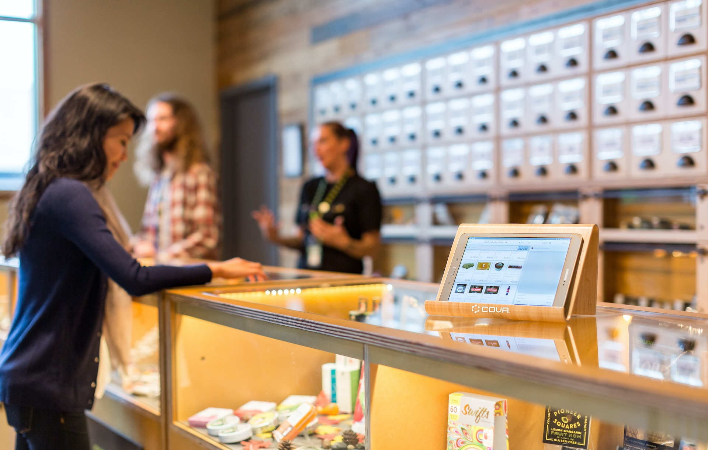

# Simples POS is a product management, administration and sales system. works in react and this project was developed with vite

---

## Documentation

#### Products

For the new product ID, the database is traversed to find the highest number, in order to assign the next number to the new one.
The IDs start from 10_000 with an empty base.

    let idMayor = 1;
    db.forEach((el) => {
      if (el.id >= idMayor) {
        idMayor = el.id;
      }
    });
    console.log(form);
    idMayor++;
    form.id = idMayor;
